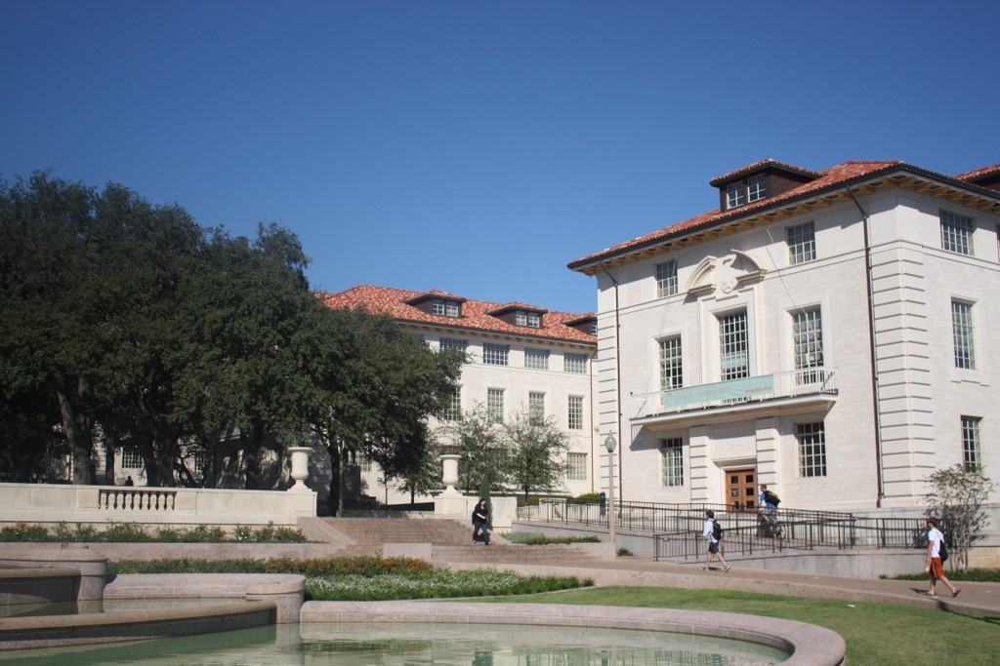
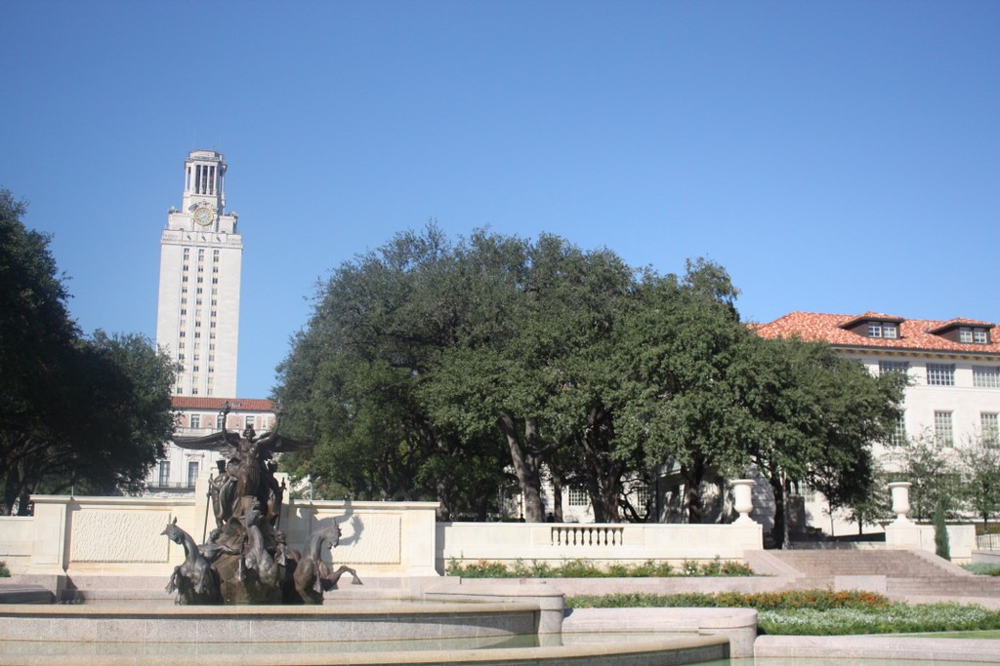

# Vision Algorithms

## Feature Matching and Image Stitching

Report: [Link](https://docs.google.com/document/d/1kOSYU41aEM0BuxFiCCiIhXmkOMDkUoLPArne_ug2_J4/edit?usp=sharing)

## Requirements

```bash
pip install opencv-python
git clone https://github.com/aditya-jha13/vision-tasks
```

`opencv-python` is installed for implementing various vision algorithms required for the task.

## Installation

```bash
git clone https://github.com/aditya-jha13/vision-tasks
```

## Usage

```bash
python3 main1.py
```
```bash
python3 main2.py
```
## Demo

### Input Images

Template Image



Transformed Image



### Detected Keypoints

Template Image


Transformed Image


### Matched Keypoints


### Stitched Image


## About

`SIFT detectors` are used to detect `Keypoints` and their descriptions, furthermore Descriptor Matches are found using `Brute Force Matcher`. Then `.pt` attribute (Coordinates of Keypoints) are extracted from each Keypoints and a list of individual coordinates is created from matched descriptors for both Images. Finally `Homography Matrix` is found using those matched points and `warp perspective` is applied on the second Image to combine it with the First Image.

## Refrences

- Keypoints: [Link](https://docs.opencv.org/3.4/d2/d29/classcv_1_1KeyPoint.html)
- Homography: [Link](https://docs.opencv.org/4.5.2/d9/dab/tutorial_homography.html)
- `cv::warpPerspective`: [Link](https://docs.opencv.org/4.5.2/da/d54/group__imgproc__transform.html#gaf73673a7e8e18ec6963e3774e6a94b87)
